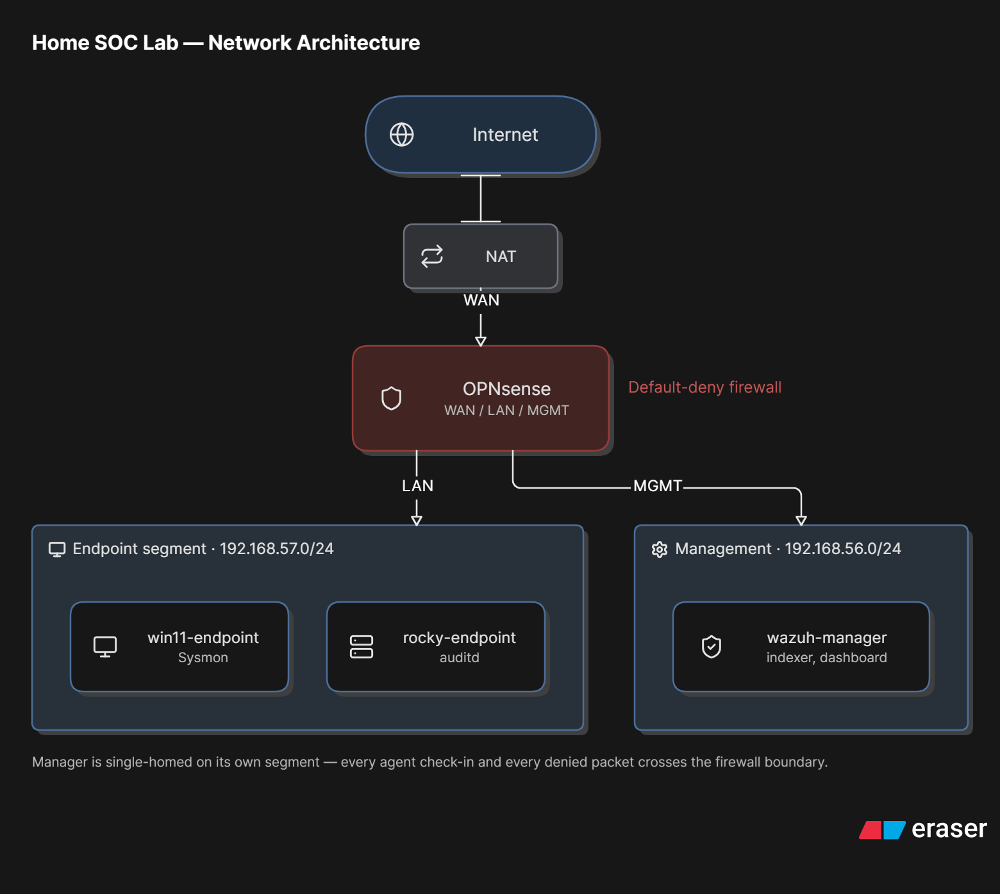

# SIEM Detection Lab — Home SOC Build

A self-built, segmented home-lab SOC environment: Wazuh SIEM, a default-deny firewall, cross-platform endpoint telemetry, and custom detection rules — each validated against real MITRE ATT&CK-mapped attacks, not assumed to work.

Built as a portfolio project for **SOC Analyst / Cybersecurity Engineer / Network Engineer / GRC Analyst** roles.

---

## What this demonstrates

Most home-lab SIEM projects stop at "I installed Wazuh and it shows alerts." This one goes further on the things that actually separate a working detection stack from a demo:

- **Verifying controls are enforced, not just configured.** A firewall segmentation rule that looks correct on paper isn't a control until you've confirmed nothing routes around it.
- **Testing detections against real attacks, not trusting the dashboard.** Every detection rule here was validated by running an actual named ATT&CK technique and confirming the alert — or the absence of one — with evidence.
- **Correcting your own findings.** One suspected detection gap in this project turned out to be a false alarm caused by a flawed verification method, not a real gap in Wazuh's ruleset. It's documented below as a retraction rather than left standing or quietly dropped — presenting it as a "fix" would have been a credibility risk, not a finding.

## Architecture



The manager sits on its own segment, deliberately single-homed rather than bridging both zones — every agent check-in and every denied packet crosses the firewall boundary, which is what makes the firewall worth having.

## Stack

| Component | Choice | Why |
|---|---|---|
| SIEM | Wazuh | Agent-based collection out of the box, realistic footprint for a lab |
| Firewall | OPNsense | Fully open licensing, default-deny segmentation |
| Windows endpoint | Windows 11 + Sysmon (SwiftOnSecurity config) | Process, registry, and network telemetry beyond stock Event Log |
| Linux endpoint | Rocky Linux 9 + auditd | Kernel-level execve and file-access auditing |
| Attack simulation | Atomic Red Team | Named, ATT&CK-mapped technique execution — not synthetic tests |

## Build phases

| Phase | Scope | Status |
|---|---|---|
| 1. Environment build | Hypervisor, networking, Wazuh install | ✅ Complete |
| 2. Log source onboarding | Agents + firewall syslog, verified end-to-end | ✅ Complete |
| 3. Baseline validation | Coverage audit, "what does normal look like" | ✅ Complete |
| 4. Attack simulation | ATT&CK techniques executed across both endpoints and the firewall boundary | ✅ Complete |
| 5. Detection engineering | 4 custom rules built + independently re-verified; 1 suspected gap investigated and retracted | ✅ Complete |
| 6. Documentation | This repo, phase write-ups, resume material | ✅ Complete |

## Findings worth reading

**A firewall segmentation gap, closed with a rule that doesn't depend on volume.** Wazuh's only firewall-alerting rule out of the box is burst-detection (18+ blocked events in 45 seconds from one source) — it would never catch a slow, deliberate single-connection probe from the endpoint segment toward the management segment, which is exactly the shape of real lateral movement. Closed with a rule matching on segment pair and action alone, independent of frequency, and verified with an `nmap` scan that generated zero alerts before the fix and a correctly-firing alert after.

**Two real Linux detection gaps, closed with evidence.** Wazuh's default ruleset alerted on `auditd` *configuration changes* but never on the commands those rules were actually built to capture — a full category of telemetry was being collected and silently dropped at the rule layer. Separately, cron persistence detection worked only because it happened to catch the `crontab` binary's own log line; a direct write to the cron spool directory bypassed it completely. Both were found via live Atomic Red Team / manual technique execution, closed with custom rules, and re-verified with the same method that surfaced them.

**One suspected gap, investigated and retracted.** Phase 3 baselining concluded that Wazuh's stock Sysmon registry ruleset had a structural blind spot for per-user (`HKCU`) Run-key persistence, based on an initial query returning no alerts for a test write. Before building a rule to "fix" this, a deeper check — re-testing live with Atomic Red Team, then confirming the regex behavior directly in Python outside the Wazuh pipeline — showed the stock rule's pattern was never anchored to the path prefix believed to be required, and it had been matching `HKCU`-style paths all along. The original finding was inaccurate; the custom rule was deleted rather than kept as a redundant "fix" for a gap that didn't exist. Included here because catching your own false positive before it ships is the same skill as catching a real one.

**Ingestion is not alerting.** The single most repeated lesson across every phase: logs reaching the manager and being correctly parsed is not the same as a rule firing on them. Confirmed directly (via raw archive logs, `ausearch`, and the dashboard's raw event view) before concluding any gap was real, in both directions — including the retraction above.

## Detection rules built

| Rule ID | Target | MITRE technique | Verified via |
|---|---|---|---|
| 100400 | Command execution on Linux endpoint | T1059 | Live re-test: unprivileged command → alert fires |
| 100401 | Privileged (root) command execution on Linux endpoint | T1059 | Live re-test: `sudo` command → separately-firing alert |
| 100402 | Direct write to cron spool (bypasses crontab's own logging) | T1053.003 | Live re-test: direct file write → FIM alert, after fixing a stale-agent-config issue that had been silently masking it |
| 100500 | Blocked traffic from endpoint segment to management segment, independent of frequency | T1046 | Live re-test: `nmap` scan against the management segment → alert fires |

One anchoring bug was found and fixed during this work: rules 100400/100401 were initially written as unanchored substring matches, which caused `exec_commands_root` events to also match the `exec_commands` pattern and be captured by the wrong (first-declared) rule. Fixed with `pcre2` anchors (`^exec_commands$` / `^exec_commands_root$`) and re-verified live.

## Repository structure

```
├── docs/
│   ├── phase1-environment-build.md
│   ├── phase2-network-architecture.md
│   ├── phase3-baseline-normal.md
│   ├── phase4-attack-simulation.md
│   └── phase5-detection-rules.md
├── detections/
│   └── local_rules.xml          # Custom Wazuh rules, sanitized
├── configs/
│   └── *.conf.example           # Sanitized configs, no real IPs/secrets
└── screenshots/
```

## What's not in here

Real IPs, hostnames, and credentials are scrubbed from every config and screenshot. A dedicated bare-metal attacker box (Kali Linux) was set up alongside the lab but ultimately wasn't needed — Atomic Red Team's on-host execution model covered the detection-validation goal directly, without requiring a separate external-attacker vantage point. It remains a natural next addition for genuine cross-network attack simulation (e.g., external port scanning, exploitation against the firewall's WAN interface) rather than on-host technique execution.
